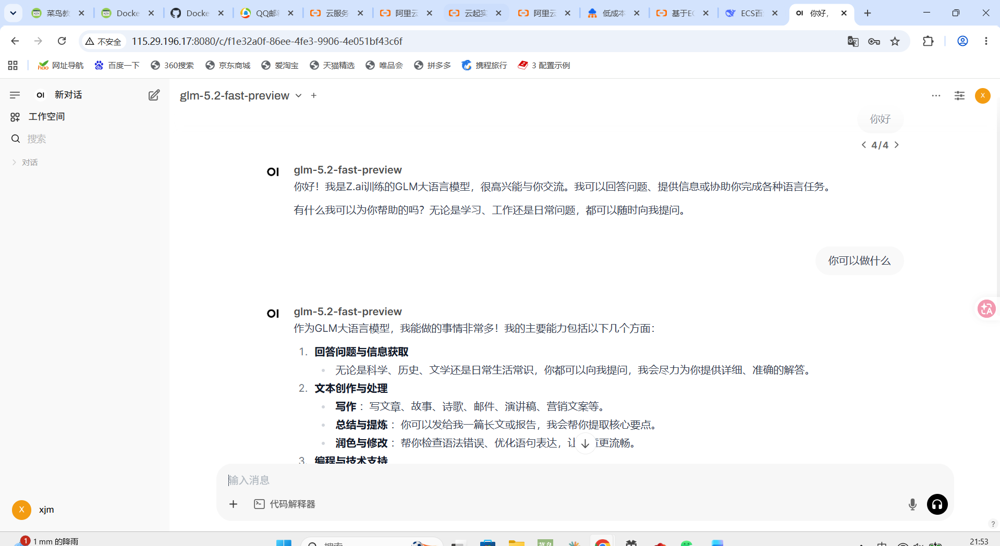

**第一步：确认 ECS 实例满足条件**
     1. 确定其操作系统（示例中为Alibaba Cloud Linux），以及服务器实例具有公网IP，安全组VPC入方向放行22端口（SSH连接）和8080端口（OpenWebUI访问）

**第二步：连接实例并安装Docker**
     1. 远程连接：登录控制台，通过Workbench远程连接到你的Alibaba Cloud Linux实例
     2.安装Docker：

     添加Docker软件包安装源
     `sudo wget -O /etc/yum.repos.d/docker-ce.repo`
      `http://mirrors.cloud.aliyuncs.com/docker-ce/linux/centos/docker-ce.repo`

      下载Alibaba Cloud Linux3专用的dnf源兼容插件
      `sudo dnf -y install dnf-plugin-releasever-adapter --repo alinux3-plus`

      安装Docker及插件
      `sudo dnf -y install docker-ce docker-ce-cli containerd.io docker-buildx-plugin docker-compose-plugin`

      启动Docker并设置开机自启
      `sudo systemctl start docker`
      `sudo systemctl enable docker`

**第三步：配置百炼API信息**

     1. 获取API Key：这一步需要开通百炼服务，并获取API Key
      注意：开通之后千万注意别欠费

     2. 设置环境变量：在终端中执行以下命令
     `export OPENAI_API_BASE_URL=https://dashscope.aliyuncs.com/compatible-mode/v1`
     `export OPENAI_API_KEY=<您的API密钥>`

     3. 创建数据目录：执行以下命令，为OpenWebUI创建持久化存储目录（后续OpenWebUI里的对话以及其他数据均本地存储在这个路径下）
     `sudo mkdir -p /mnt/open-webui-data`

**第四步：拉取镜像并安装OpenWebUI**

     （我用的是第二种，用Docker进行拉取）

     1. `docker pull ghcr.io/open-webui/open-webui:main`

//补充：关于第一种方法`docker pull ghcr.io/open-webui/open-webui:main`，这种是用官方网站进行拉取，由于我本人的服/务器是国内的而非国外的，所以用这个命令拉取会非常慢

//给出的解决方法是，将docker的daemon.json文件里的加速器配置修改为`https://docker.1ms.run`和`https://docker.xuanyuan.me`，然后重启daemon和docker,`sudo systemctl daemon-reload`和`sudo systemctl restart docker`。最后用国内加速器拉取open-webui。（这种方法会比官方快很多）

//但倘若解决方案不生效的话，需要自己去网上找加速器去试，看哪个国内加速器能用且效果好
     
     2. 启动容器
     `docker run -d \`
        --name open-webui \
        --restart always \
        -p 3000:8080 \
        --add-host=host.docker.internal:host-gateway \
        -v /mnt/open-webui:/app/backend/data \
        ghcr.io/open-webui/open-webui:main

**第五步:访问OpenWebUI**
    1. 在浏览器中访问  http://<你的ECS公网IP地址>:8080
    2.注册账号（首次访问时，页面会提示）

**注意**
    部署自己的ai平台的第一步和关键点是：要在服务器上开端口（22，8080），下Docker，用docker启动Open WenUI。后续自己想使用哪个大模型就自己接入相应api以及url即可。

    Open WebUI只是一个Web前端，它与市面上常见可视化界面AI应用最大的区别就是，拥有者可以自己选择想要接入的大模型api接入，想用什么就接什么，而且所有数据均保存在自己云服务器上，不会出现数据泄露问题。

    