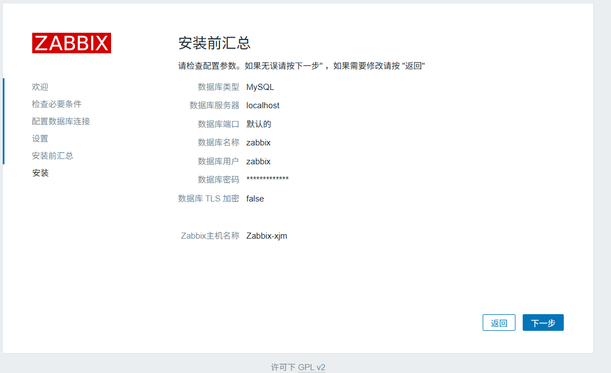
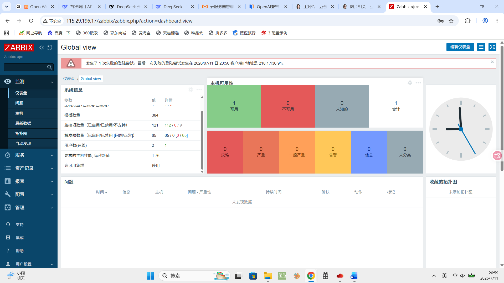

**第一步：环境准备**
    1. 关闭/放行服务器防火墙、安全组端口
    首先关闭防火墙
    然后安全组内增加22（ssh）和10051（允许所有来源访问Zabbix监控端口）和10050（允许访问Agent客户端端口）

    setenforce 0
    sed -i 's/^SELINUX=enforcing/SELINUX=disabled/' /etc/selinux/config   //关闭SELinux

    然后更新系统
    dnf update -y

//注意：10050端口核心作用是允许Zabbix Server以“被动模式”从Zabbix Agent获取监控数据

**补充**

**10050端口是 Zabbix Agent 的“监听”端口，它在此端口上等待来自Zabbix Server的指令,在此模式下，Zabbix Server 会主动向部署在被监控主机上的 Zabbix Agent 发起连接请求。Server会根据预设的监控项和时间间隔，周期性地连接Agent的10050端口，请求特定的监控数据。Agent收到请求后，会收集相应数据并响应给Server**

**第二步：安装数据库 MariaDB**

    dnf install mariadb-server mariadb -y
    systemctl enable --now mariadb //初始化数据库，设置root密码，删除匿名用户
    mysql secure_installation

**第三步：创建Zabbix数据库与账号**

    mysql -uroot -p     //执行SQL，核心作用是以“root”用户的身份，通过密码验证的方式，登录到本机的数据库管理系统中

//预安装zabbix-sql-scripts-6.0.47

    在 Zabbix 6.0+ 中，初始化 SQL 脚本被拆分为多个文件，并放在 /usr/share/zabbix-sql-scripts/mysql/ 目录下。
    在 Zabbix 6.0+ 中，数据库初始化脚本被拆分为：
    •	server.sql.gz：Zabbix Server 所需的主数据库结构（替代原来的 create.sql.gz）
    •	proxy.sql：Zabbix Proxy 使用
    •	其他辅助脚本

    zcat /usr/share/zabbix-sql-scripts/mysql/server.sql.gz | mysql -uzabbix -pZabbix@密码 “数据库用户名” //完整密码为Zabbix@密码

    CREATE USER “数据库用户名”@localhost IDENTIFIED BY '密码';
    GRANT ALL ON zabbix.* TO zabbix@localhost;//授予 Zabbix 软件访问自身数据库的“全部权限”
    FLUSH PRIVILEGES; //让 MySQL 重新加载系统权限表中的数据，使内存中的权限缓存立即生效
    exit;

**第四步：添加Zabbix官方YUM源（6.0LTS）**

    rpm -ivh https://repo.zabbix.com/zabbix/6.0/rhel/8/x86_64/zabbix-release-6.0-4.el8.noarch.rpm //安装zabbix仓库

    dnf clean all //清理缓存
    dnf makecache //清理缓存

**第五步：安装Zabbix服务端、前端、客户端**

    dnf install zabbix-server-mysql zabbix-web-mysql zabbix-apache-conf zabbix-agent -y

**第六步：导入Zabbix初始数据库模板**

    zcat /usr/share/zabbix-sql-scripts/mysql/server.sql.gz | mysql -uzabbix -pZabbix@Zabbix数据库密码 Zabbix用户名

**第七步：配置Zabbix Server数据库连接**

    vi /etc/zabbix/zabbix_server.conf

    修改以下参数：
    DBHost=localhost
    DBName=zabbix
    DBUser=“Zabbix用户名”
    DBPassword=“Zabbix密码”

**第八步：配置PHP时区（Apache）**

    vi /etc/php-fpm.d/zabbix.conf

//然后，光标拉到文件最底部，回车新建一行，粘贴：

    php_value[date.timezone] = Asia/Shanghai

**第九步：启动并自启所有服务**

    systemctl enable --now zabbix-server zabbix-agent httpd php-fpm

//查看状态
    systemctl status zabbix-server //状态为绿色的active(running)为正常

**第十步：Web页面初始化安装**

    1. 浏览器访问：http://服务器公网地址//zabbix
    2. 按照向导做下一步:
    •	检查所有依赖项全部 OK
    •	数据库填写：主机localhost，库名，用户名，密码
    •	Zabbix 服务器名称自定义
    3. 完成安装，默认账号：Admin /Zabbix

    初始用户名为Admin，密码为zabbix

