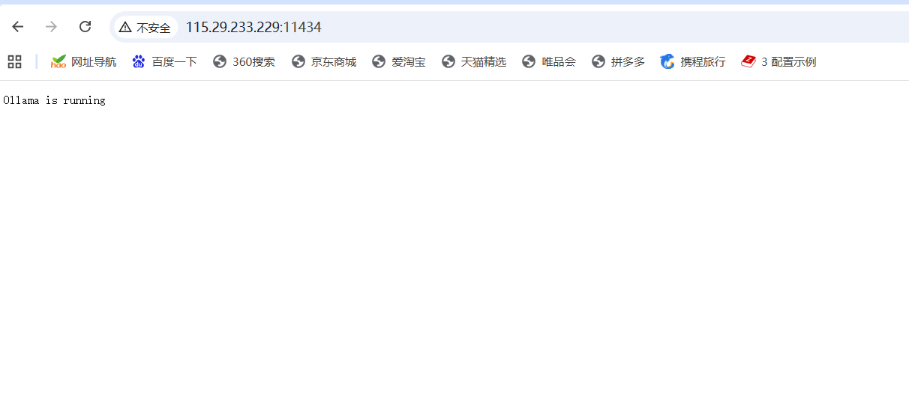

**简介**
    Ollama 是一个开源工具，旨在简化大型语言模型（LLM）的本地部署和运行。你可以把它想象成“AI 模型的 Docker”，它通过封装复杂的配置和依赖，让你能用简单的命令在个人电脑上运行各种开源大模型。

**第一步：下载Ollama软件包**

//如果是国外服务器的话，直接使用官网脚本安装命令即可，curl -fsSL https://ollama.com/install.sh | sh

//但此处，由于我图方便，就直接使用了了在Windows本地下载好了再使用xftp上传到ECS服务器上进行解压缩和安装
    本地下载地址：
    https://modelscope.cn/models/Lixiang/ollama-release/

    然后安装前进行zstd工具的安装以便于进行Ollama安装包的解压
    sudo dnf install zstd
    
    进行解压：
    zstd -d /tmp/ollama-linux-amd64.tar.zst -o /tmp/ollama-linux-amd64.tar
    //此时将 /tmp 目录下以 .tar.zst 格式压缩的 Ollama 安装包，解压成标准的 .tar 归档文件。

    将 .tar 文件解包到 /tmp 目录
    tar -xvf /tmp/ollama-linux-amd64.tar -C /tmp/

    解包完成后，你会得到一个文件夹/tmp/ollama-linux-amd64/

    进入目录执行安装脚本，sudo /tmp/ollama-linux-amd64/install.sh

**注意：在安全组里应该放行的11434端口，否则Open WebUI里无法调用Ollama里的各种模型**

**进行验证：访问http://服务器公网地址:11434，如果出现Ollama is running,即成功**

**最后，在OpenWebUI里，要使用Ollama拉取的大模型的话，需要打开OpenWebUI里的设置，打开外部链接，打开Ollama API，将Ollama API地址修改为http://服务器私网地址:11434**

//拉取Ollama大模型在下面实验中进行