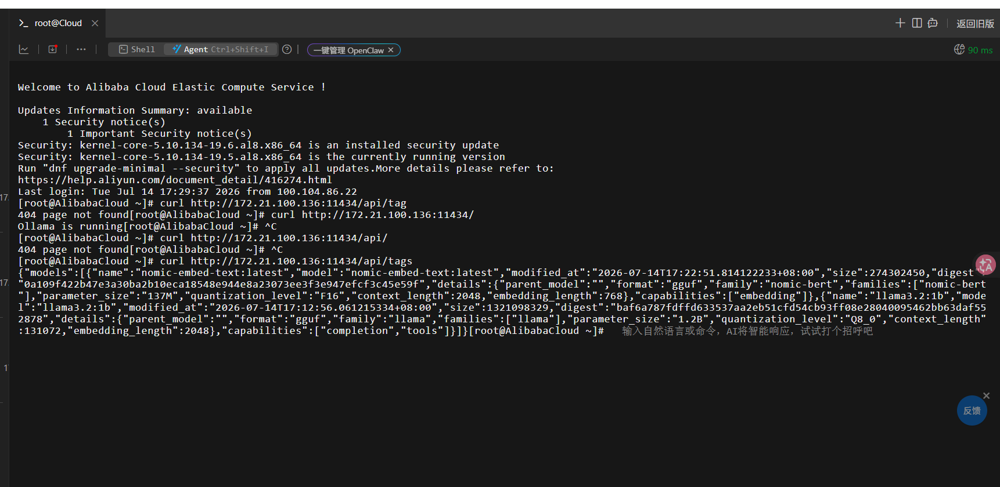
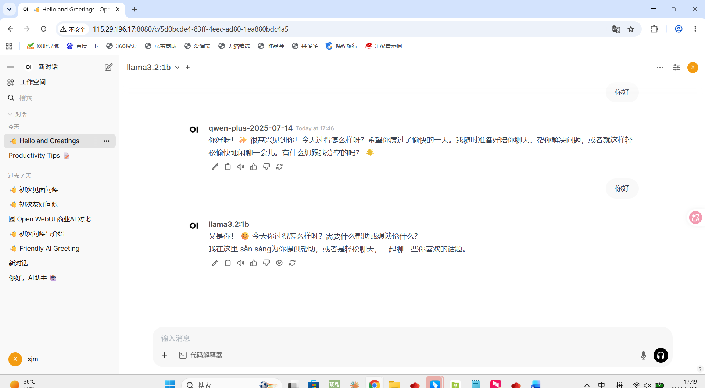
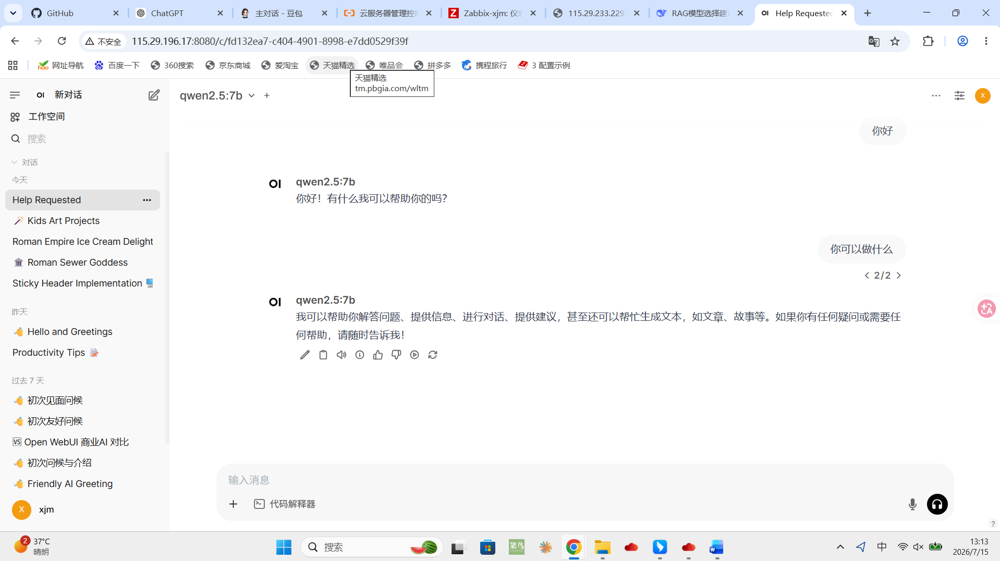

**第一步：进行测试**

    1. 先拉取测试模型llama3.2:1b

`llama3.2:1b模型特点：超轻量，支持128K上下文窗口，但中文能力偏弱，复杂推理弱`

    ollama pull llama3.2:1b

    2. 拉取完测试模型llama3.2:1b后，进行nomic-embed-text模型的拉取

`nomic-embed-text是开源文本嵌入模型，作用：下载一个专门用于将文本转换为向量的嵌入模型。主打长文本检索、本地私有化部署，广泛应用与RAG、语义搜索、文本聚类、相似度计算`

    ollama pull nomic-embed-text

    3. 在下载拉取Ollama的服务器里输入，
    
    ollama list

    能看到llama3.2:1b和nomic-embed-text模型即说明以上步骤拉取成功

    4. 进入OpenWebUI里确保Ollama API的链接正确

    例如：http://服务器内网地址:11434

    5. 在运行OpenWebUI的服务器上输入

    curl http://服务器内网ip:11434/api/tags

`注意：现有两种情况。一种是OpenWebUI和Ollama均部署在同一服务器上，此时按照以上方法常规操作即可；第二种是OpenWebUI和Ollama部署在不同服务器上，此时特别注意要在VPC安全组里放行部署OpenWebUI的服务器公网地址访问去访问部署Ollama服务器服务的服务器公网地址的11434端口`

`若是第一种情况，4和5中的服务器内网地址均填入部署OpenWebUI的内网地址即可；若是第二种情况，就得填入部署Ollama服务器的内网地址`

`总之，4和5中的地址，一定要放部署Ollama服务的服务器内网地址`

    结果能看见存在的大模型即成功

    6.在OpenWebUI里的设置，文档里输入语义向量模型引擎（http://部署Ollama的服务器内网IP:11434）和语义向量模型(nomic-embed-text),输完后点击保存然后重启网页

    7. 在OpenWebUI里使用llama3.2:1b大模型，能正常对话即调用Ollama拉取大模型成功

**第二步：拉取更好用的大模型qwen2.5:7b**

    1. ollama pull qwen2.5:7b
    2. ollama list
    看见拉取列表里有qwen2.5:7b则拉取成功
    3.在openwebui网页前端再进行测试，使用qwen2.5:7b即说明成功

**额外拓展**
**使用大模型除了Ollama拉取，还能够在OpenWebUI的设置，外部连接里的管理OpenAI API里计入你自己想用的接口连接，例如deepseek的是，https://api.deepseek.com（但使用这种方式时一定要确保api-key已生成并且余额充足未欠费）**

`用OpenAI API和Ollama API是很不一样的，前者本地对话数据会被回传到模型的外部服务器，存在一定的数据泄露问题，不是完全本地私有哈；后者使用Ollama API是完全本地私有化的，此时AI平台完全不存在数据泄露危害，因为所有数据都回传在本地服务器上进行保存（在OpenWebUI服务器上本地保存，Ollama服务器上数据处理）`

