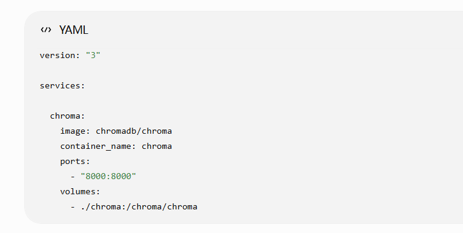
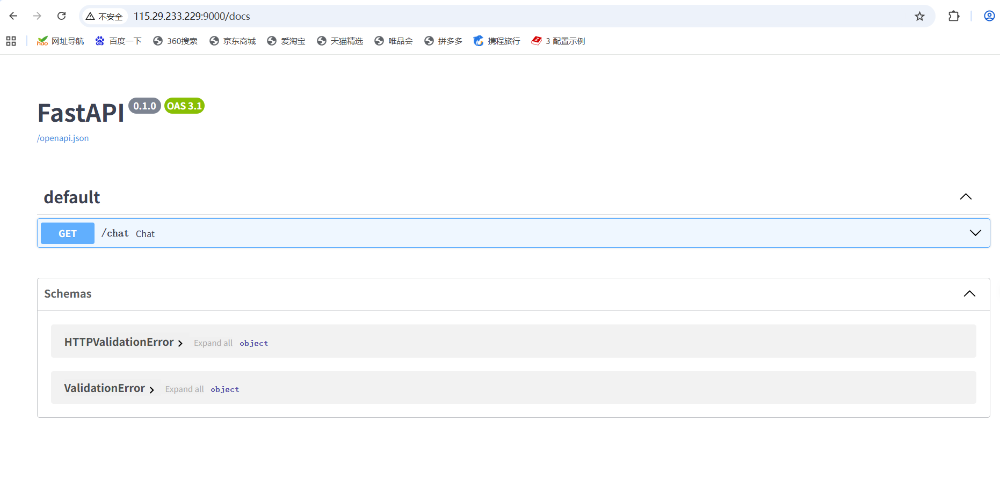

**步骤一：检查Docker是否能正常使用**

    此节实验要用到Docker Hub拉取镜像
    （关于Docker的相关问题将在实验6中提及）

**步骤二：创建RAG项目目录**

    1. mkdir ~/private-rag

**第三步：部署ChromaDB**

    1. vim docker-compose.yml
    

    2. 根据当前目录下的 docker-compose.yml 配置文件，在后台创建并启动所有定义好的服务容器。
    docker compose up -d

    2. 进行校验
    docker ps
`注意：要在private-rag目录下进行校验，否则会报错`
    当看到有名为chroma的容器时并且显示0.0.0.0:8000->8000，结果正确，拉取成功
    `服务器入口要放行8000端口`

**第四步：创建RAG服务**

    1.在app文件下创建依赖文件
    vim requirements.txt
    内容如下:
    langchain
    langchain-community
    langchain-ollama
    chromadb
    fastapi
    uvicorn
    pypdf

`requirements.txt文件里这些库包含了RAG的数据加载、向量存储、检索、推理和API服务全链路`

    2. 安装依赖
    pip install -r requirements.txt
`做到这一步时可能会出现由于python3版本过低无法下载部分依赖的情况，此时只要进行python3.11的安装升级就可以了，然后再重新安装`

**第五步：写RAG代码**

    创建main函数，内容如下：
    import sys
    import pysqlite3

    sys.modules["sqlite3"] = pysqlite3

    from fastapi import FastAPI

    from langchain_chroma import Chroma
    from langchain_ollama import OllamaEmbeddings, ChatOllama

    from langchain_core.prompts import ChatPromptTemplate

    app = FastAPI()

    embedding = OllamaEmbeddings(
    model="nomic-embed-text"
    )

    db = Chroma(
    persist_directory="../chroma",
    embedding_function=embedding
    )

    llm = ChatOllama(
    model="qwen2.5:7b"
    )

    prompt = ChatPromptTemplate.from_template(
    """
    请根据下面的资料回答问题：

    {context}

    问题：
    {question}
    """
    )

    @app.get("/chat")
    def chat(q: str):

    docs = db.similarity_search(q, k=3)

    context = "\n".join(
        [doc.page_content for doc in docs]
    )

    response = llm.invoke(
        prompt.format(
            context=context,
            question=q
        )
    )

    return {
        "answer": response.content
    }

**第六步：启动RAG API**

    //在app路径下进行（不然会报错）
    1. 启动RAG API
    uvicorn main:app --host 0.0.0.0 --port 9000

    2. 验证RAG API是否启用成功
    http://部署RAG服务器的公网IP:9000/docs能正常访问即运行成功
`注意：要在服务器安全组入方向放行9000端口`

    结果如下：

`特别注意：要先启动RAG API成功后才能访问http://部署RAG服务器的公网IP:9000/docs成功`

**第七步 ：导入需要的文档**

    直接将需要的文档导进documents文件夹下

**第八步：添加ingest.py**

`这里需要注意的是，ingest.py里有  loader = PyMuPDFLoader("../documents/test.pdf"   , 在ingest.py里的文件名称和路径要与documents下的文件名称和路径一摸一样，不然会报错)`

    代码如下：
    print("1. 开始导入模块")

    import sys
    import pysqlite3

    sys.modules["sqlite3"] = pysqlite3

    from langchain_community.document_loaders import    PyMuPDFLoader
    from langchain_chroma import Chroma
    from langchain_ollama import OllamaEmbeddings

    print("2. 模块导入完成")

    loader = PyMuPDFLoader("../documents/test.pdf")
    print("3. 创建 Loader 完成")

    docs = loader.load()
    print(f"4. PDF 加载完成，共 {len(docs)} 页")

    embedding = OllamaEmbeddings(model="nomic-embed-text")
    print("5. Embedding 初始化完成")

    db = Chroma.from_documents(
    docs,
    embedding,
    persist_directory="../chroma"
    )

    print("6. 向量库创建完成")

**运行ingest.py**

    python ingest.py
    `注意：这里向量转化的时间可能有点长，会卡一段时间，请耐心等待`

