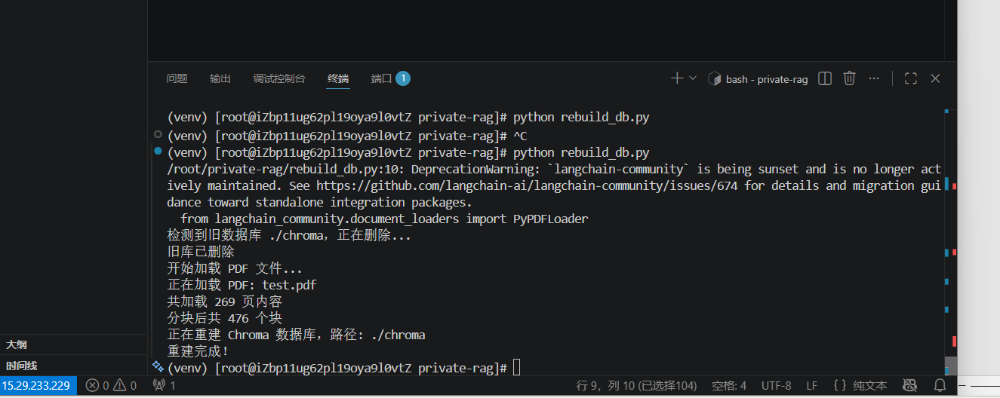
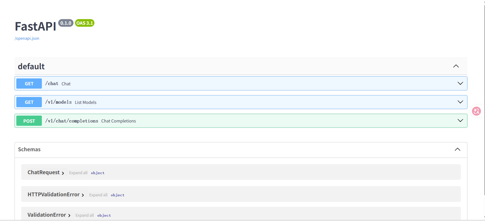
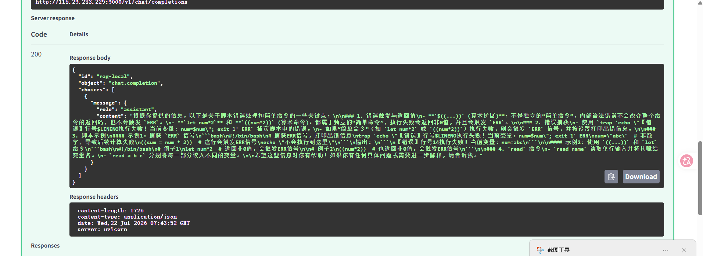
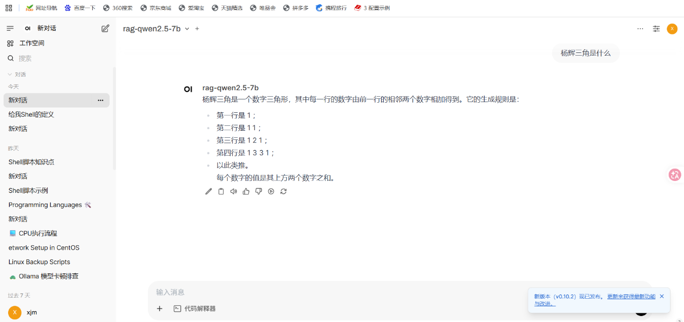
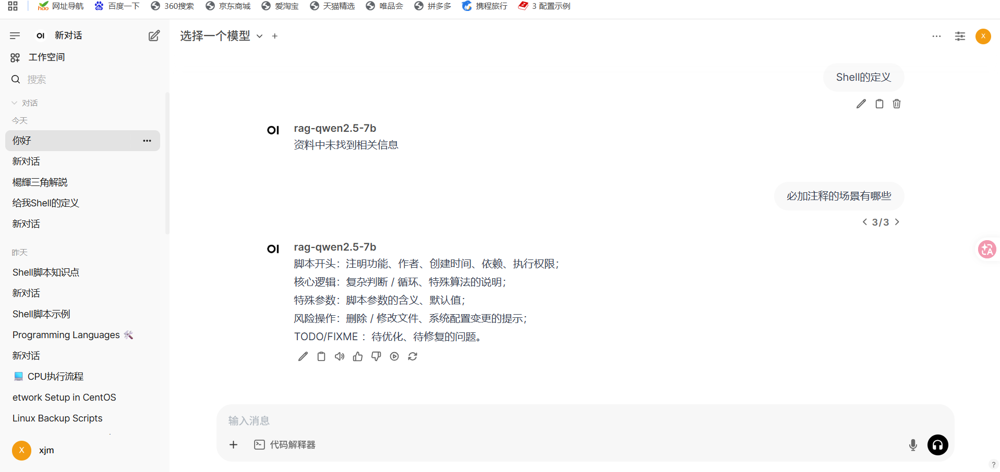

`此实验代码基本就是在实验5的基础上进行添加`

**步骤一：修改requirements.txt并重装依赖**

    内容是：
    langchain
    langchain-community
    langchain-ollama
    chromadb
    fastapi
    uvicorn
    pypdf
    langchain-ollama
    rank-bm25

    然后运行命令
    pip install -r requirements.txt（在app路径下进行）

**步骤二：创建rebuild_db.py并运行**

    内容：
    import shutil
    import sys
    import pysqlite3
    sys.modules["sqlite3"] = pysqlite3

    import os
    from langchain_chroma import Chroma
    from langchain_ollama import OllamaEmbeddings
    from langchain_text_splitters import RecursiveCharacterTextSplitter
    from langchain_community.document_loaders import PyPDFLoader

    MAX_PAGES=15

    # 配置
    PDF_DIR = "./documents"          # PDF 存放目录（相对于脚本运行位置）
    CHROMA_PATH = "./chroma"         # Chroma 持久化目录（根目录下）
    CHUNK_SIZE = 800
    CHUNK_OVERLAP = 200

    if os.path.exists(CHROMA_PATH):
        print(f"检测到旧数据库 {CHROMA_PATH}，正在删除...")
        shutil.rmtree(CHROMA_PATH)
        print("旧库已删除")

    # 加载所有 PDF 
    def load_pdfs(directory):
        all_docs = []
        for filename in os.listdir(directory):
            if filename.lower().endswith(".pdf"):
                file_path = os.path.join(directory, filename)
                print(f"正在加载 PDF: {filename}")
                loader = PyPDFLoader(file_path)
                docs = loader.load()
                docs = docs[:MAX_PAGES]  # 限制每个 PDF 的最大页数
                print(f"只加载了前{len(docs)}页内容")
                all_docs.extend(docs)
        return all_docs

    print("开始加载 PDF 文件...")
    documents = load_pdfs(PDF_DIR)
    print(f"共加载 {len(documents)} 页内容")

    #分块 
    text_splitter = RecursiveCharacterTextSplitter(
        chunk_size=CHUNK_SIZE,
        chunk_overlap=CHUNK_OVERLAP,
        separators=["\n\n", "\n", "。", "！", "？", "；", "，", " ", ""]
    )
    chunks = text_splitter.split_documents(documents)
    print(f"分块后共 {len(chunks)} 个块")

    # 初始化 Embedding 
    embedding = OllamaEmbeddings(model="nomic-embed-text")

    # 重建 Chroma 数据库（会覆盖旧库）
    print(f"正在重建 Chroma 数据库，路径: {CHROMA_PATH}")
    db = Chroma.from_documents(
        documents=chunks,
        embedding=embedding,
        persist_directory=CHROMA_PATH
    )
    print("重建完成！")

    进行chroma向量重建
    python rebuild_db.py

    结果：

**步骤三：修改main.py代码**

    import asyncio
    from fastapi import FastAPI
    from fastapi.responses import JSONResponse
    from fastapi.middleware.cors import CORSMiddleware
    from pydantic import BaseModel

    import sys
    import pysqlite3
    sys.modules["sqlite3"] = pysqlite3

    from langchain_chroma import Chroma
    from langchain_ollama import OllamaEmbeddings, ChatOllama
    from langchain_core.prompts import ChatPromptTemplate
    from langchain_community.retrievers import BM25Retriever

    # FastAPI实例化
    app = FastAPI()

    # CORS
    app.add_middleware(
        CORSMiddleware,
        allow_origins=["*"],
        allow_credentials=False,
        allow_methods=["*"],
        allow_headers=["*"],
    )

    # 初始化 Embedding 模型
    embedding = OllamaEmbeddings(model="nomic-embed-text")

    # 加载已有向量库
    db = Chroma(
        persist_directory="../chroma",
        embedding_function=embedding
    )

    # ---------- 构建 BM25 检索器 ----------
    all_docs_data = db.get()
    doc_texts = all_docs_data['documents']
    metadatas = all_docs_data.get('metadatas', [None] * len(doc_texts))

    bm25_retriever = BM25Retriever.from_texts(doc_texts, metadatas=metadatas)
    bm25_retriever.k = 30   # 增大候选数

    # 构建向量检索器（MMR 重排序，提高多样性）
    vector_retriever = db.as_retriever(
        search_type="mmr",
        search_kwargs={
            "k": 30,               # 返回30个
            "fetch_k": 150,        # 候选池150
            "lambda_mult": 0.3     # 0.3 更偏重多样性
        }
    )

    # 初始化 LLM
    llm = ChatOllama(model="qwen2.5:7b")

    # 分级 Prompt（允许推断）
    prompt = ChatPromptTemplate.from_template(
    """
    你是一个知识渊博的助手，需要根据以下提供的资料回答问题。请遵循以下规则：

    1. 如果资料中有与问题完全匹配的原文句子，请**直接引用原文**（不加修饰）。
    2. 如果资料中没有完全匹配的原文，但包含相关的信息或上下文，请**基于资料内容进行合理推断**，用自己的话总结答案，并在开头说明“根据资料推断：”。

    请确保你的回答**有据可依**，不要凭空编造。

    资料：
    {context}

    问题：{question}

    回答：
    """
    )

    #端点

    @app.get("/chat")
    def chat(q: str):
        # 分别检索
        bm25_docs = bm25_retriever.invoke(q)
        vector_docs = vector_retriever.invoke(q)
        
        # 合并去重
        seen = set()
        merged = []
        for doc in bm25_docs + vector_docs:
            if doc.page_content not in seen:
                seen.add(doc.page_content)
                merged.append(doc)
        
        # 取前50个（若少于50则全部）
        docs = merged[:50]
        context = "\n".join([doc.page_content for doc in docs])

        # 调试日志
        print("\n=== RETRIEVED CONTEXT ===")
        print(context)
        print("=== END OF CONTEXT ===\n")

        response = llm.invoke(prompt.format(context=context, question=q))

        print("=== MODEL RESPONSE ===")
        print(response.content)
        print("=== END OF RESPONSE ===\n")

        return {"answer": response.content}

    @app.get("/v1/models")
    async def list_models():
        return {
            "object": "list",
            "data": [
                {
                    "id": "rag-qwen2.5-7b",
                    "object": "model",
                    "created": 1720000000,
                    "owned_by": "rag-server"
                }
            ]
        }

    class ChatRequest(BaseModel):
        model: str
        messages: list

    @app.post("/v1/chat/completions")
    async def chat_completions(req: ChatRequest):
        user_q = req.messages[-1]["content"]
        res = await asyncio.to_thread(chat, q=user_q)
        return JSONResponse(content={
            "id": "rag-local",
            "object": "chat.completion",
            "choices": [{"message": {"role": "assistant", "content": res["answer"]}}],
        })

**第四步：重新开启uvicorn**

    uvicorn main:app --host 0.0.0.0 --port 9000
    //重启uvicorn服务

    此时再访问http://115.29.233.229:9000/docs，会发现多了GET和POST

**第五步：进行连通性测试**

    在FastAPI进行测试，点击POST的try it out然后进行输入请求体，
    `{ "model": "qwen2.5:7b", "messages": [ {"role": "user", "content": "测试知识库"} ] }`

**第六步：在OpenWebUI里的设置里的连接的OpenAI API里新增RAG的链接地址，并把模型名称填入加入**

`切记：我在main.py里get里的id写的是，rag-qwen2.5-7b，所以OpenWebUI里填入的模型名一定要和main.py里的id一模一样，不然会失败`

`注：RAG在哪个地址，在OpenAI API里就填入哪个url`
`比如：我的RAG在某一服务器上搭建，所以URL就是http://私网ip:9000/v1`

# 补充：关于RAG部署以及大模型回答我遇到的问题以及解决方法

1. 终端发现能读取到我的RAG里的文档，但是存在“睁眼说瞎话”的情况，在文档里有原话的前提下进行提问，依旧回答未找到相关资料

    关于这点，我在代码中构建向量检索器（MMR 重排序，提高多样性），对"k"，"fetch_k"，"lambda_mult"进行微调
    并且对Prompt提示词进行了优化，引导大模型尽量按照原文回答

2. documents里的pdf有两百多页，进行向量库重构和大模型回答时非常慢

    关于这点，我在rebuild_db.py里设置模型只读文档前十五页，修改了之后再python rebuild_db.py进行向量库重构时就快多了，但模型回复慢问题依旧存在。大概率是因为我的服务器配置较低的问题。
    如果设备配置比较高的话，可以多读取一些文档，并且多装一些依赖对代码进行再调试，会比现在的低配置代码效果好很多

`模型使用结果`

